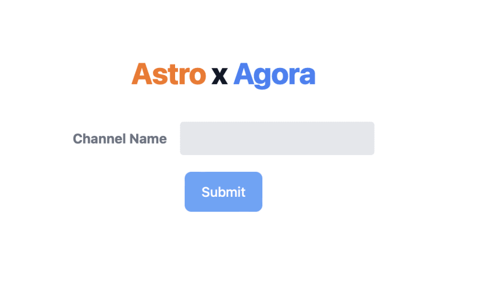
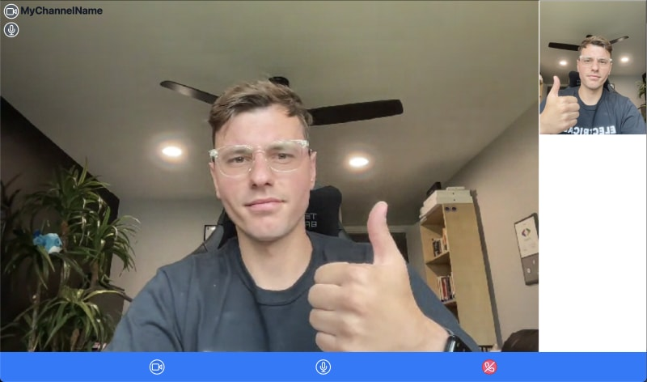

# Astro x Agora

## How to Run
1. Add `PUBLIC_AGORA_APP_ID = '<---Your App Id--->'` to your `.env` file.
2. Run `npm install` to install all dependencies.
3. Run `npm run dev` to start the server.

